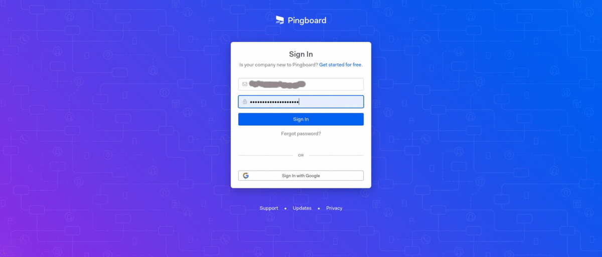

# Sequr Importer Avatar

👤 a simple CLI to help you import avatars from different services in to ours

<div align="center">
	
</div>

# How to install

Since this is a NPM package you'll need to have NodeJS in your system. After that you can just type the following command to install thsi tool.

```
sudo npm install -g @sequr/sequr-import-avatar
```

Once this part is done, you can run the app by typing: `sequr-avatar`.

# How to uninstall

```
sudo npm uninstall -g @sequr/sequr-import-avatar
```

# How to update package to latest version

```
sudo npm update -g @sequr/sequr-import-avatar
```

# What else do I need

Before you start using this tool, you'll need to  grab a API Key from your Sequr dashboard - check this [page](https://access.sequr.io/settings/api-token). After that, you'll need to grab the credential from the service provider that you want to import the images from.

## BambooHR

Similar to Sequr, you can generate an API Key from your dashboard

## Pingboard

Follow the instruction to get a client id and client secret

Step-1 Login in pingboard account<br />
Step-2 In navigation bar click on admin and select add-ons option<br />
Step-3 Click on pingboard api<br />
Step-4 Click on manage service account api<br />
Step-5 If you have already service account use that credentials otherwise, create a service account<br />
Step-6 From service account take client id and client secret



**Important**: All the credentials are stored in RAM, and when the CLI quits all the data will be lost. We don't store any credentials on the hard drive. This means that at every execution you'll have to provide the credentials again.

**As a reminder**: Keep all your secrets in a secure place

# How to use

This is a CLI application with a simple ASCII UI which is going to guide you, and ask all the relevant questions.

We hope you'll find this tool useful.

# Contact

If you have any questions, please don't hesitate to send us an email at: support@sequr.io
